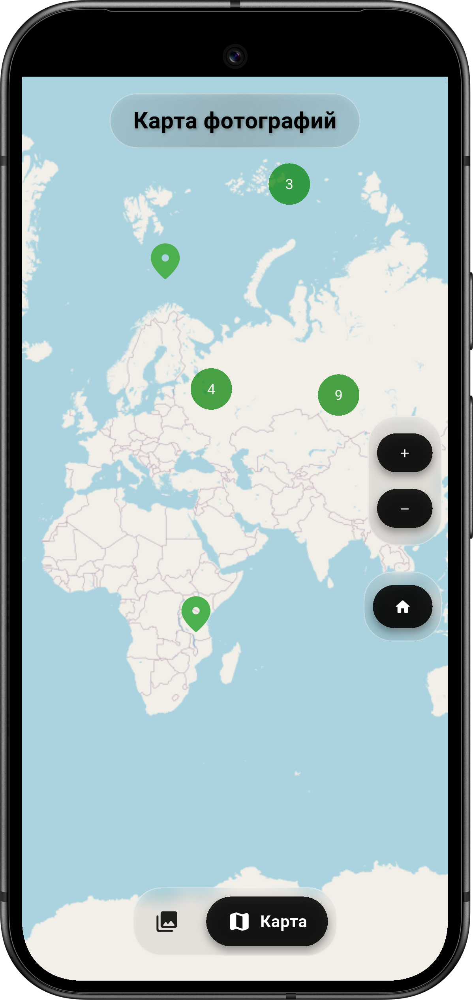
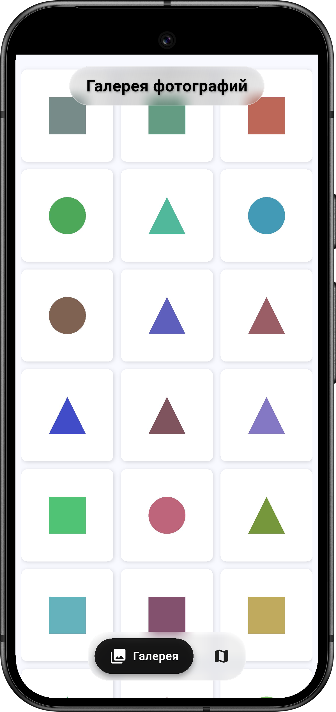
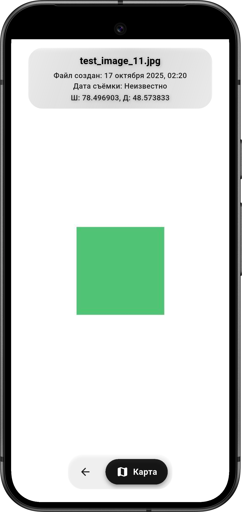

# geo_album_v2_aurora_edition (Мобильное приложение "ГеоАльбом")

Функциональное мобильное приложение на Flutter под ОС "Аврора", выполняющее функции галереи просмотра фото с возможностью отображения фото на карте.

## Скриншоты примеров работы

<div align="center">
  
  
  
</div>

## Функциональность приложения

Данное приложение имеет следующие функциональные особености:

1. Возможность просмотра фотографий (JPG, JPEG, PNG) из папки ~/Pictures и получения основной информации о них (название файла на устройстве, дата создания файла, GPS-координаты при наличии)

2. Возможность просмотра на карте геометок тех фотографий, которые имеют в своём exif зашитые метаданные GPS-координат места съёмки.

3. Возможность переключения между экранами карты и галереи.

4. Лаконичное визуальное оформление, интуитивно понятный интерфейс

5. Возможность просмотра фотографии как с экрана галереи, так и с экрана карты. На экране галереи фотографии представлены в виде плиток, на экране карты - в виде маркеров на карте, нажатие на которых переводит на экран просмотра фотографии

6. Русская локализация


## Установка

Для установки и сборки данного приложения под ОС "Аврора" необходимо:

1. Клонировать репозиторий:
```bash
git clone https://github.com/SpikyOne/geo_album_v2_aurora_edition-.git
```

2. Перейти в директорию проекта:
```bash
cd geo_album_v2_aurora_edition-
```

3. Установить пакеты зависимостей:
```bash
flutter-aurora pub get
```

4. Запустить сборку приложения:
```bash
flutter-aurora build aurora --release
```

5. Полученный установочный RPM-пакет, который можно подписать и установить на эмулятор или устройство. Или же можно сразу прописать:
```bash
flutter-aurora run
```


## Лицензия

В соответствии с условиями олимпиады, даннный проект лицензирован под условиями BSD-3 Clause, файл лицензии приложен к проекту (см. файл [LICENSE](LICENSE)).

## Авторы

В соответствии с условиями олимпиады, список авторов собран в файле  [AUTHORS.md](AUTHORS.md).
